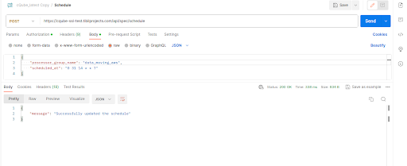

# Adding a New Program

1. **Schema Definition**
   1. Event Schema: The event schema defines the structure of the events to be ingested into the system. It includes information such as the event name, its attributes (e.g. event timestamp, user ID, etc.), and data types.
   2. Dimension Schema: The dimension schema defines the dimensions, or attributes, that will be used to group and filter events. It includes information such as the dimension name, its attributes (e.g. dimension value, category, etc.), and data types.
2. **Grammar Ingestion**
   1. Event Grammar: The event grammar defines the specification in which the events will be expressed. It includes information such as name, datatype, if its primary key, dimension or metric, ref table if dimension, format etc.

<figure><figcaption></figcaption></figure>

b. Dimension Grammar: The dimension grammar defines the specification in which the dimensions will be expressed. It includes information such as name, type and key information.

<figure><figcaption></figcaption></figure>

**3. Automatic Dataset Grammar Generation:**

Based on the configuration, the system will automatically generate data set grammars. The configurations can include whitelisting or blacklisting of dimensions to consider and additional combinations to consider.

**4. Data Ingestion:**

Once the schema and grammar are defined and the data set grammar is generated, events from APIs or CSV files can be ingested into the system. The following steps will occur during ingestion:

* Schema level validation of the incoming events.
* If new dimensions are found, they will be added to the Dimension Master.
* Based on the combinations of dimensions and metrics in datasets, upsert operations will occur, and datasets will be updated.
* All datasets will be updated with aggregates.

**5. Visualizations:**

Datasets can be used to fetch data and perform calculations before utilizing it for visualizations. Based on the indicator and chart type combinations, different visualizations will be generated, and they can be arranged in a dashboard
