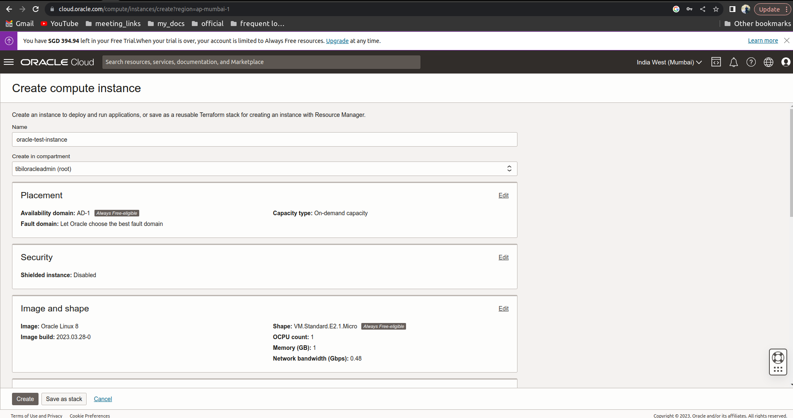

# For Oracle Server

The document covers the following:

1. [Setting up Oracle for cQube](for-oracle-server.md#oracle-setup-for-cqube)
2. [Instructions to fill oracle config variables while doing installation](for-oracle-server.md#instructions-to-fill-oracle-config-variables-while-doing-installation)

## **Oracle setup for cQube**

### **Creating the Instance in Oracle Cloud:**

1. Login to the oracle cloud account using the credentials
2. Click on the left side menu button and then click on compute

3. Click on instances and then click on create instance
4. Provide the instance name and modify the **image and shape** by clicking on edit button

5. Change image to ubuntu 22.04

.png>)

6. Change shape to 2 core OCPU and 16GB RAM

.png>)

7. Create the default subnet

8. Download the private key file

.png>)

9. Select the boot volume to 100GB

10. Click on create the instance

### **Creating Storage bucket:**

1. Click on side main menu button and select storage and then buckets

2. Create a bucket with all the default configurations. ( Fill name of bucket )

.png>)

3. Please refer to the below pic to get the created bucket name and name-space. ( Need to provide while generating config file in cqube)

.png>)

### **Generating config file in oracle cloud:**

Required this config file to communicate between the storage and the application

1. Login to the oracle cloud account using the credentials
2. Navigate to profile

3. Navigate to API keys from the left side menu

4. Generate a new key pair using add key option

5. Download the private key and click on Add

6. Copy the content of configuration file, keep it pasted in some notepad for further use and close the popup

### **Uploading the api key file to the cqube server:**

\
1\. Connect to the cqube server

2\. Copy the oracle API private key from local machine to server using following command

`scp -i <pem_file_of_server> <private_key_of_oracle_api> ubuntu@<ip>:~/`

3\. Enter into root user

`sudo su`

4\. Change the directory to root

`cd /root`

5**.** Create a directory using the following command

`mkdir .oci && cd .oci`

6**.** Copy private key from home directory to root directory

`mv /home/<system_user_name>/<private_key_of_oracle_api> .`

7\. Make sure if the file is present in the current directory

`ls -ltr`

7\. Exit from the root user and continue for cqube installation

`exit`

8\. Refer this doc for cqube installation

[cQube Deployment Document](https://docs.google.com/document/d/1ODP13lUjO4OYV-rkFhPs-XMG0aehsfiWcCekkAN3Bfs/edit#heading=h.oqy188kfbwi5)

### **Instructions to fill oracle config variables while doing installation**

This config file needs to be filled when installing the cqube. Please refer to the config file which is copied while creating the API keys in Oracle:

1. Enter a location for your config \[/root/.oci/config]: /root/.oci/config
2. Enter a user OCID: \<Enter the user OCID from api key config file>
3. Enter a tenancy OCID: \<Enter the tenancy OCID from api key config file>
4. Enter a region by index or name: \<Enter the region from api key config file>
5. Do you want to generate a new API Signing RSA key pair? (If you decline you will be asked to supply the path to an existing key.) \[Y/n] : \<Click n>
6. Enter the location of your API Signing private key file: /root/.oci/\<private\_key\_of\_oracle\_api>
