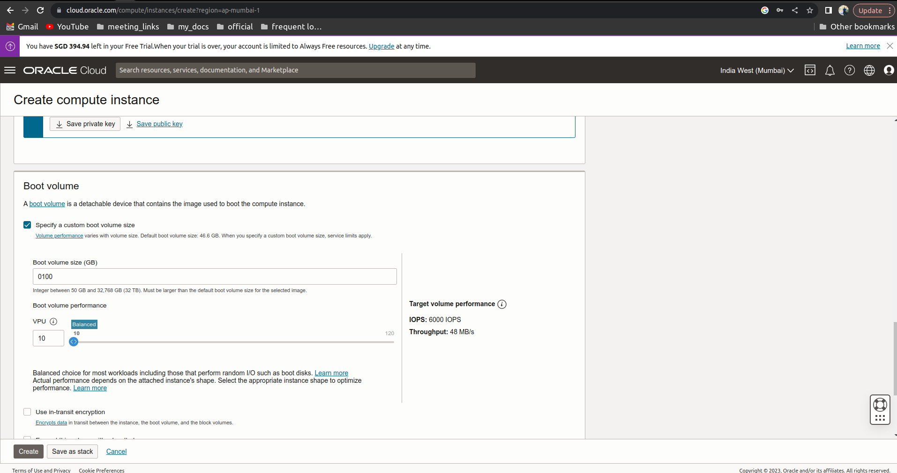
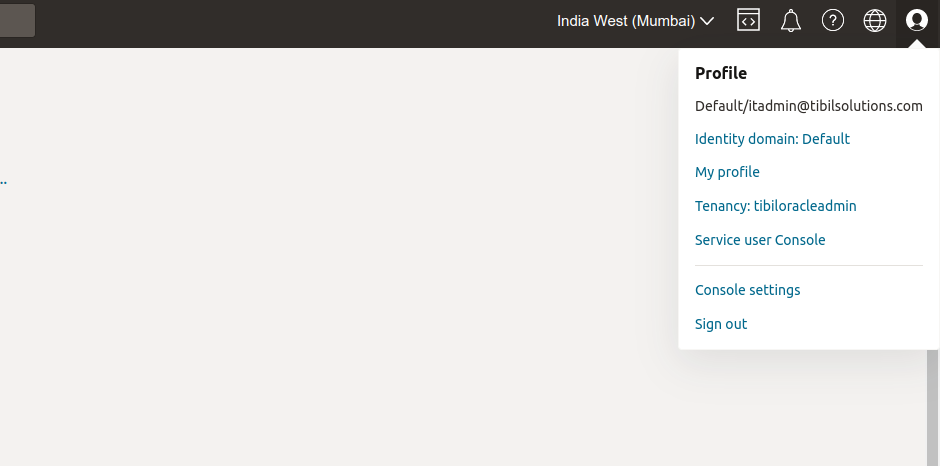
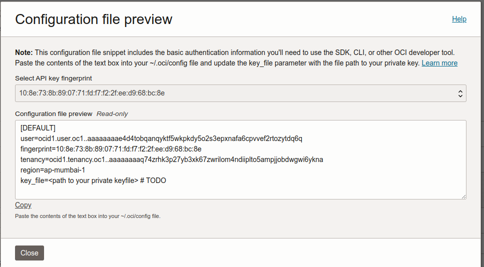

# Step-wise Upgradation Process

Upgradation is currently available on 3 types of servers:

1. [AWS](step-wise-upgradation-process.md#upgradation-process-for-aws)
2. [Azure](step-wise-upgradation-process.md#upgradation-process-for-azure)
3. [On-Premise (Local)](step-wise-upgradation-process.md#upgradation-process-for-local)

Steps for each one of these servers have been explained below:

### **Upgradation process for AWS**

**Step - 1:** Connect to the cqube AWS ec2 instance

* **For linux and macOS:**
  * Download the .pem file which is generated while creating the EC2 instance
  * Open the terminal and navigate to the folder where .pem file has been downloaded
  * Then give the read permission to the .pem file using following command

`sudo chmod 400 <aws.pem>`

* Use the following command to connect to the instance

`ssh -i <path_to_the_pem_file> <user_name>@<public_ip_of_the_instance>`

* **For windows:**
  * Download the .pem file which is generated while creating the EC2 instance
  * Use puttygen to connect to the instance.
  * Refer following link to use puttyGen for connecting.
    * [https://docs.aws.amazon.com/AWSEC2/latest/UserGuide/putty.html](https://docs.aws.amazon.com/AWSEC2/latest/UserGuide/putty.html)

### **Upgradation process for AZURE**

**Step - 1:** Connect to the cqube Azure VM instance

* **For linux and macOS:**
  * Download the .pem file which is generated while creating the azure VM instance
  * Open the terminal and navigate to the folder where .pem file has been downloaded
  * Then give the read permission to the .pem file using following command

**sudo chmod 400 \<aws.pem>**

* Use the following command to connect to the instance

`ssh -i <path_to_the_pem_file> <user_name>@<public_ip_of_the_instance>`

* **For windows:**
  * Download the .pem file which is generated while creating the azure VM instance
  * Use puttygen to connect to the instance.
  * Refer following link to use puttyGen for connecting.
    * [https://docs.aws.amazon.com/AWSEC2/latest/UserGuide/putty.html](https://docs.aws.amazon.com/AWSEC2/latest/UserGuide/putty.html)

### **Upgradation process for LOCAL**

**Prerequisites to install cQube on local machine**

* Ubuntu 22.04 (supported)
* 16 GB of System RAM (minimum requirement)
* 4 core CPU (minimum requirement)
* Domain name (with SSL)
* 250 GB Storage

**Step - 2:** Clone the cqube-devops repository using following command

`git clone` [`https://github.com/Sunbird-cQube/cqube-devops.git`](https://github.com/Sunbird-cQube/cqube-devops.git)

<figure><figcaption></figcaption></figure>

**Step - 3:** Navigate to the directory where cqube is cloned or downloaded and checkout to the desired branch

`cd cqube-devops/ && git checkout dev`

<figure><figcaption></figcaption></figure>

**Step - 4:** Give the following permissions to the upgrade.sh file

`sudo chmod u+x upgrade.sh`

**Step - 5:** Upgrade cqube with non root user with sudo privileges

`sudo ./upgrade.sh`

<figure><figcaption></figcaption></figure>

upgrade.sh file contains a shell script where it will run shell scripts and ansible-playbook to setup the cqube

**Step - 6:** User Input Variables - These are the variables which need to be entered by the user by following the Hint provided

<figure><figcaption></figcaption></figure>

* state\_name ( Enter the required state code by referring to the state list provided )
* api\_end\_point ( Enter the url in which cqube to be configured )
* Storage\_type (Enter the storage\_type as aws or local or azure. If User opting for aws You will be prompted with the following AWS s3 credentials to enter and it will create the s3 bucket. If s3\_bucket already exists it will prompt you to enter a unique s3 bucket name. And it will be generated in the upgradation\_config.yml.)
* s3\_access\_key
* s3\_secret\_key
* s3 bucket name

<figure><figcaption></figcaption></figure>

* Storage\_type (Enter the storage\_type as local, minio will install and configure the minio username and minio password and create the minio bucket And it will be generated in the upgradation\_config.yml.)

* Storage\_type (Enter the storage\_type as Azure, If User opting for Azure you will be prompted with the following Azure credentials to enter and it will create an azure container , if azure container exists it will prompt to enter a unique azure container name. And it will be generated in the upgradation\_config.yml.)
* azure\_connection\_string
* azure\_account\_name
* azure\_account\_key

<figure><figcaption></figcaption></figure>

**Step - 7:** Optional\_variables- Database credentials contain default values. If the user wishes to enter their own credentials then the user should opt for **yes** to enter their credentials otherwise can opt for **no** when the question pops up

* db\_user\_name ( Enter the postgres database username )
* db\_name ( Enter the postgres database name )
* db\_password ( Enter the postgres password )

**Step - 8:** Optional\_variables- Read Only Database credentials contain default values. If the user wishes to enter their own credentials then the user should opt for **yes** to enter their credentials otherwise can opt for **no** when the question pops up

* read\_only\_db\_user ( Enter the read only postgres database username )
* read\_only\_db\_password ( Enter the read only postgres password )

**Step - 9:** Keycloak\_variables- Keycloak credentials with Keycloak admin user name and keycloak admin password.

* Keyclaok\_adm\_name (Enter the keycloak admin name eg: admin)
* Keyclaok\_adm\_password (enter the keycloak admin password eg: Admin@123)

**Step - 10:** Once the upgradation\_config file is generated, A preview of the upgradation\_config file is displayed followed by a question where the user gets an option to re enter the configuration values on choosing **yes. I**f option **no** is selected then the upgrade.sh moves to the next section.

**Step - 11:** A preview of the program\_selector.yml file is displayed followed by a question where the user gets an option to enable or disable the programs on choosing **yes. I**f option **no** is selected then the upgrade.sh moves to the next section.

**Step - 12:** Once the Upgradation is completed, You will be prompted with the following messages and required reference urls.

**cQube Upgraded Successfully!**

<figure><figcaption></figcaption></figure>

cQube ingestion api can be accessible using \<domain\_name>

Ingestion Usage Documentation :[ https://project-sunbird.atlassian.net/l/cp/PPn7AfAW](https://project-sunbird.atlassian.net/l/cp/PPn7AfAW)

Schema Documentation :[ https://project-sunbird.atlassian.net/l/cp/xpVi7HbS](https://project-sunbird.atlassian.net/l/cp/xpVi7HbS)

UI Usage Documentation :[ https://project-sunbird.atlassian.net/l/cp/mv7JvLXd](https://project-sunbird.atlassian.net/l/cp/mv7JvLXd)

### **Appendix** 

### **AWS - Network Architecture** 

The following steps define the cQube setup and workflow completion processes in AWS. cQube mainly comprises the areas mentioned below:

1. EC2 Server
2. IAM user and Role creation for S3 connectivity.

The cQube network setup process is described in the block diagram below:

### &#x20;

### **Microservices Details** 

Following are the details of the microservices which get installed in the cqube server.

* **Ingestion-ms:** The ingestion-ms is used to upload the data of the events, datasets, dimensions, transformers and pipeline. All these apis will be to ingesting the data into the cQube.
* **Spec-ms:** The spec-ms is used to import schema of the events, datasets, dimensions, transformers and pipeline. All these specs will be defined by the cQube platform prior to ingesting the data into the cQube. These specifications are derived by considering the KPIs as the Indicator.
* **Generator-ms:** The generator-ms is used to create the specs & transformers for the derived datasets. Performed aggregation logics, updating data to datasets based on transformation. Status update of file processing
* **Nifi-ms:** Apache NiFi is used as a real-time integrated data logistics and simple event processing platform
* **Postgres-ms:** Postgres microservice contains the schema and tables
* **Nginx-ms:** It is commonly used as a reverse proxy and load balancer to manage incoming traffic and distribute it to slower upstream servers
* **Kong-ms:** It is a lightweight API Gateway that secures, manages, and extends APIs and microservices.
* **Dashboard-ms**: It consists of an angular app, it is used to visualize the datasets present in postgres-ms in the form of charts. On run time it requests spec-ms to fetch data from postgres-ms and load it into the client side(Browser)
* **Query\_builder-ms:** It consists of backend API, which consists of JWT,METRICS,QUERY apis

JWT - it will generate a jwt token to restrict the other apis.

METRICS - it consists of menus for the navigation bar and dashboard cards.

QUERY - this api used for executing the SQL queries which integrated with Dashboard-ms.

LASTMODIFIED - this api will use for the last modified data in the s3,azure and minio

### &#x20;

### **cQube Deployment Procedure** 

upgradel.sh sh file contains a shell script where it will run following shell scripts and ansible-playbook to setup the cqube

**Basic\_requirements.sh:**

This script basically updates and upgrades the software packages in the server and installs the basic softwares such as

* Python3
* Pip3
* Ansible
* Docker
* Docker compose

**upgradation\_Config\_file\_generator.sh:**

This script is used to generate a configuration file which contains some constant values and few required variables should be entered by the user. Following are the variables which get added in the config file.

**Note:** Users should follow the Hints provided in the description and should enter the variables accordingly. If the entered value is wrong then an error message gets displayed and the user should modify the variable value accordingly.\
Constant Variables: These variables are auto generated

* System\_user\_name
* base\_dir
* Private\_ip
* aws\_default\_region

User Input Variables-These are variables which need to be entered by the user by following the Hint provided

* state\_name ( Enter the required state code by referring to the state list provided )
* api\_end\_point ( Enter the url in which cqube to be configured )
* storage\_type

Storage\_type is aws enter the below variables

* s3\_access\_key
* s3\_secret\_key
* s3 bucket name

Storage\_type is azure enter the below variables

* azure connection string
* azure account name
* Azure account key
* azure container name

Storage\_type is a local system that will automatically create the minio username and minio password and minio bucket.

* minio username
* minio password
* minio bucket

**Minino can be accessed by Dashboard with** [**http://localhost**](http://localhost/)**:9001 end point, here you can see the minio bucket which is created by default and the username is minioadmin and password is minioadmin**

Optional\_variables - Database credentials contain default values. If the user wishes to enter their own credentials then the user should opt for **yes** to enter their credentials otherwise can opt for **no** when the question pops up

* db\_user\_name ( Enter the postgres database username )
* db\_name ( Enter the postgres database name )
* db\_password ( Enter the postgres password )

Optional\_variables- Read Only Database credentials contain default values. If the user wishes to enter their own credentials then the user should opt for **yes** to enter their credentials otherwise can opt for **no** when the question pops up

* read\_only\_db\_user ( Enter the read only postgres database username )
* read\_only\_db\_password ( Enter the read only postgres password )

Once the upgradation\_config file is generated, A preview of the upgradation\_config file is displayed followed by a question where the user gets an option to re enter the configuration values on choosing **yes. I**f option **no** is selected then the upgrade.sh moves to the next section.

**Repository\_clone.sh:**

This script clones the following repositories in the microservices directory and checkout to the required release branch

* git clone [https://github.com/Sunbird-cQube/spec-ms.git](https://github.com/Sunbird-cQube/spec-ms.git)
* git clone [https://github.com/Sunbird-cQube/ingestion-ms.git](https://github.com/Sunbird-cQube/ingestion-ms.git)
* git clone [https://github.com/Sunbird-cQube/generator-ms.git](https://github.com/Sunbird-cQube/ingestion-ms.git)
* git clone [https://github.com/Sunbird-cQube/dashboard-ms.git](https://github.com/Sunbird-cQube/dashboard-ms.git)
* git clone [https://github.com/Sunbird-cQube/query-builder.git](https://github.com/Sunbird-cQube/dashboard-ms.git)

Note: If the repository is already cloned then the script will pull the updated code.

**Ansible-playbook:**

**upgrade.yml**

An upgrade.yml ansible playbook gets triggered where it triggers the required roles to build the following microservices images.

* Ingestion-ms
* Spec-ms
* Generator-ms
* Postgres-ms
* Nifi-ms
* Dashboard-ms
* Query\_builder-ms
* Kong-ms
* Nginx-ms

**upgrade\_compose.yml:**

A docker compose ansible script gets triggered where it will up all the containers to running state.

**Note:** The following commands can be used from the Ansible directory to down the containers and to start the containers, respectively.

* docker-compose -f upgrade\_docker-compose.yml down
* docker-compose -f upgrade\_docker-compose.yml up -d

**Run\_api.sh:**

Run\_api.sh script will run the v4-data-emission api using curl command in the ingestion\_ms container. And it will run the adapter file to run VSK\_data\_transformation.sh script in the generator-ms container.

Once the Upgradation is completed, You will be prompted with the following messages and required reference urls.

**cQube Upgraded Successfully**

We can check the containers running status by using following command

* sudo docker ps

