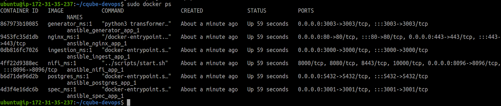

# Requesting for Support

Support may be required if the cQube adopter is stuck somewhere while setting up / managing cQube. The cQube Product Team will handhold the cQube adopter and point to the right documentations wherever support is required.

### Communication Tool

All the requests for support should be posted as Q\&A on the cQube Discussion Forum on GitHub - [Link](https://github.com/Sunbird-cQube/community/discussions/categories/q-a).

### Requesting for Support through Q\&A

A new discussion should be created in the GitHub Discussion Forum of cQube **only** if any similar discussion doesn't already exist or has been answered by the cQube Product Team. The unanswered / open discussions for cQube can be seen [here](https://github.com/Sunbird-cQube/community/discussions/categories/q-a?discussions\_q=category%3AQ%26A+is%3Aopen) and the closed discussions can be seen [here](https://github.com/Sunbird-cQube/community/discussions/categories/q-a?discussions\_q=category%3AQ%26A+is%3Aclosed).

**Process to initiate a Q\&A:**

1. Go to the Q\&A tab of cQube Discussion Forum on Github - [https://github.com/Sunbird-cQube/community/discussions/categories/q-a?discussions\_q=is%3A](https://github.com/Sunbird-cQube/community/discussions/categories/q-a?discussions\_q=is%3A)

<figure><figcaption></figcaption></figure>

2. Detail out the support that you need with a title and description. You can add any images for context on the request.

<figure><figcaption></figcaption></figure>

3. Attach relevant label(s) to the support being requested.

<figure><figcaption></figcaption></figure>

4. Click on 'Start Discussion'

### Response from the cQube Product Team

The cQube Product Team will get back within 1-2 working days post the request has been submitted with the required support.
